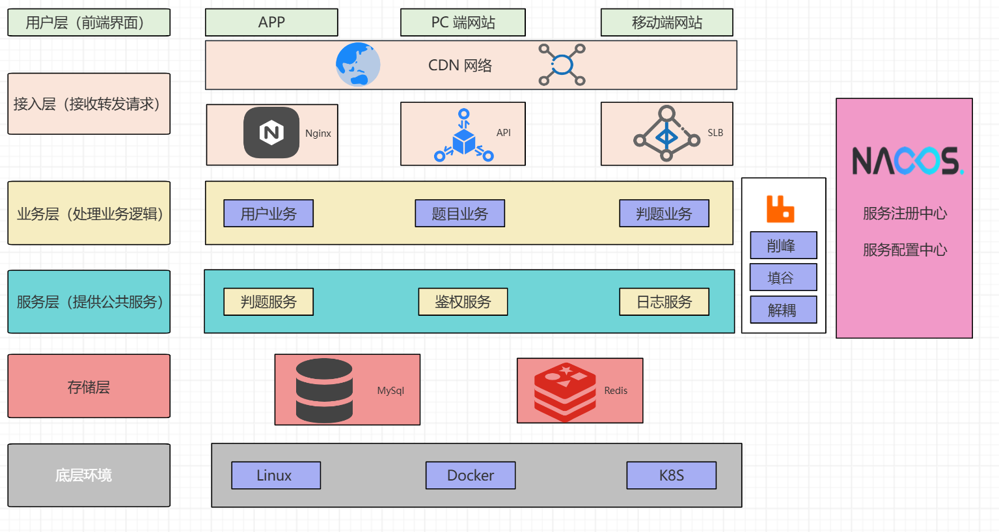

    

<h1 align="center"> ZOJ </h1>

<strong>一个集成化的在线编程学习和竞赛平台，支持用户在线课题练习和实时判题，并提供管理和分析功能，适用于教学和竞赛场景。<em>持续更新 ing～</em></strong>

    
    
     

# 项目导航
* **快速体验地址**: [https://oj.nmsl.us](https://oj.nmsl.us)
- **前端项目仓库**：[zoj-frontend](https://github.com/zhisangui/zoj-frontend)

# 项目介绍
ZOJ 在线判题系统是一个集成化的编程学习和竞赛平台，旨在为用户提供高效、安全的在线编程练习和竞赛服务。系统支持用户在线练习编程题目、实时提交代码并进行判题，同时提供丰富的题库管理和用户数据分析功能。平台通过现代化技术架构，保障了系统的可扩展性和高性能，是教学和竞赛场景中的理想工具。

## 技术选型

|          技术          | 说明                | 官网                                                                                       |
|:--------------------:|-------------------|------------------------------------------------------------------------------------------|
|      SpringBoot      | web开发必备框架         | [https://spring.io/projects/spring-boot](https://spring.io/projects/spring-boot)         |
| Spring Cloud Alibaba | 简化代码              | [https://sca.aliyun.com/](https://sca.aliyun.com/)                                       |
|       MyBatis        | ORM框架             | http://www.mybatis.org/mybatis-3/zh/index.html                                           |
|     MyBatisPlus      | 零sql，简化数据库操作，分页插件 | [https://baomidou.com/](https://baomidou.com/)                                           |
|        Mysql         | 数据库               | [https://www.mysql.com/cn/](https://www.mysql.com/cn/)                                                     |
|        Redis         | 缓存加速，多数据结构支持业务功能  | [https://redis.io](https://redis.io)                                                     |
|       Knife4j        | API 文档生成工具        | [https://doc.xiaominfo.com/docs/quick-start](https://doc.xiaominfo.com/docs/quick-start)                                                     |
|        Docker        | 应用容器引擎            | [https://www.docker.com](https://www.docker.com)                                         |
|     Docker-Java      | Java操作Docker的库    | [https://github.com/docker-java/docker-java](https://github.com/docker-java/docker-java) |
|       RabbitMQ       | 消息队列              | https://www.rabbitmq.com/                                                                |
|        Hutool        | Java工具类库          | [https://github.com/looly/hutool](https://github.com/looly/hutool)                       |

## 系统功能

### 用户功能
1. **在线编程练习**：用户可以选择题库中的编程题目，在线编写代码并提交。
2. **实时判题**：后端基于 Docker 技术构建的代码沙箱，实现安全、高效的代码判题功能。
3. **提交记录与分析**：用户可查看自己的代码提交记录及判题结果，了解编程进步情况。

### 管理员功能
1. **题目管理**：支持新增、编辑和更新编程题目。
2. **用户管理**：维护系统用户的权限及相关数据。
3. **系统监控**：对系统运行状态进行监控和维护，确保服务的稳定性。

## 系统架构
本项目采用微服务架构设计，将系统划分为多个独立的功能模块，具体如下：

1. **用户服务模块**：负责用户注册、登录及权限管理。
2. **题库管理模块**：提供题目数据的增删改查功能。
3. **判题服务模块**：基于 Docker 技术的代码沙箱，完成代码的安全执行与判题。
4. **异步消息模块**：通过 RabbitMQ 实现题目业务与判题业务的解耦，提升系统响应速度。

服务间通过 Nacos 实现注册与配置管理，采用 OpenFeign 进行高效通信，确保系统的低耦合性与高扩展性。

## 技术特色
1. **微服务架构**：模块化设计，提升了系统的可维护性与扩展性。
2. **异步通信**：通过 RabbitMQ 实现判题功能的异步处理，显著优化用户体验。
3. **容器化部署**：使用 Docker 进行服务容器化，保障了不同服务的环境隔离与快速部署。

## 其他
如果存在问题或提出建议，请联系我们：

- 邮箱：zhisangui@qq.com
- GitHub：https://github.com/zhisangui/zoj-backend-microservice